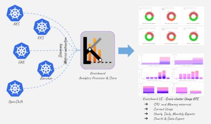
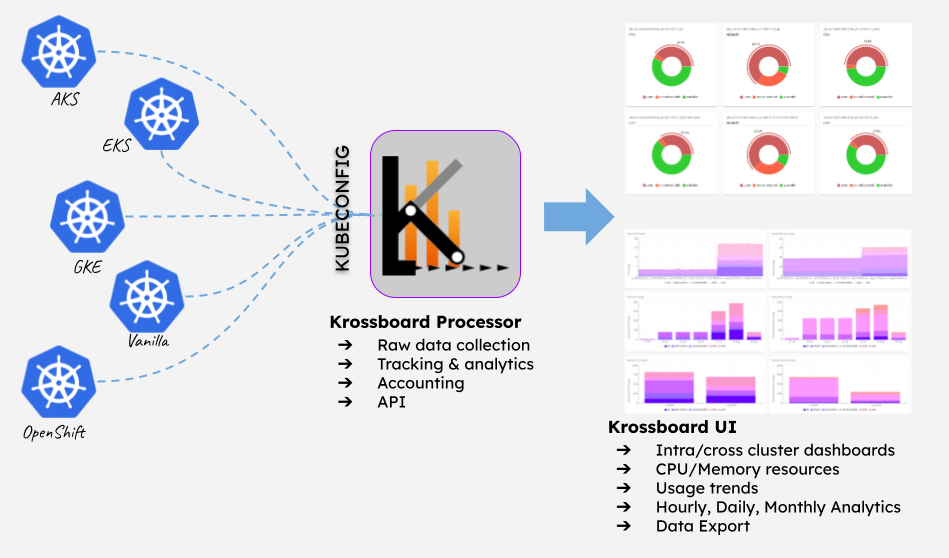

---

# Overview
`krossboard-kubernetes-operator` is the backend component of [Krossboard](https://github.com/2-alchemists/krossboard).

Key features:

* **Multi-Kubernetes Data Collection**: Periodically collecting raw metrics related to containers, pods and nodes from several Kubernetes source clusters. By design, the data collection period is 5 minutes.
* **Powerful Analytics Processing**: Internally process raw metrics to produce insightful Kubernetes usage accounting and analytics metrics. By design, these analytics metrics are handled on a hourly-basis, for every namespace, cluster, and also globally.
* **Insightful Usage Accounting**: Periodically process usage accounting, for each cluster and cluster's namespace. In the current implementation, the accounting is handled by design for the following period:  daily for the 14 last days, monthly for the 12 last months.
* **REST API**: Exposes the generated analytics data to third-party systems. For example, [Krossboard UI](https://github.com/2-alchemists/krossboard-ui) consumes this API to produce its charts and dashboards.
* **Easy to deploy**: Krossboard can be easily deployed through a virtual machine on-premises or on public clouds. In a close future, it's expected to be deployed through a Kubernetes operator. It can be set up to automatically discover and handle Kubernetes clusters backed by Amazon EKS, Google GKE, Microsoft AKS.




# Getting Started

## Create a namespace for krossboard

Krossboard Kubernetes Operator is namespaced-scoped, and is expected to be deployed in a namespace named `krossboard`.


```
kubectl create namespace krossboard
```

## Create a KUBECONFIG secret for target Kubernetes clusters

In the following command, replace `/path/to/kubeconfig` with the path towards the KUBECONFIG file that list Kubernetes clusters to be handled by Krossboard. 

```
kubectl -n krossboard \
    create secret generic krossboard-secrets  \
    --from-file=kubeconfig=/path/to/kubeconfig \
    --type=Opaque
```

If you have several KUBECONFIG files and want you can proceed as below to create a secret with a merged KUBECONFIG.

Set the KUBECONFIG environment variable with a comma-seperated list of your KUBECONFIG files.

```
export KUBECONFIG=/path/to/kubeconfig1;/path/to/kubeconfig2
```

Create a secret with the resulting merged KUBECONFIG.
```
kubectl -n krossboard \
    create secret generic krossboard-secrets \
    --from-file=kubeconfig=<(kubectl config view) \
    --type=Opaque
```

## Deploy Krossboard Kubernetes Operator
The following command deploy the latest version of the operator.

```
oc apply -k config/latest/
```

# Links

* https://krossboard.app/
* [Krossboard Enterprise support](https://krossboard.app/#pricing) 
